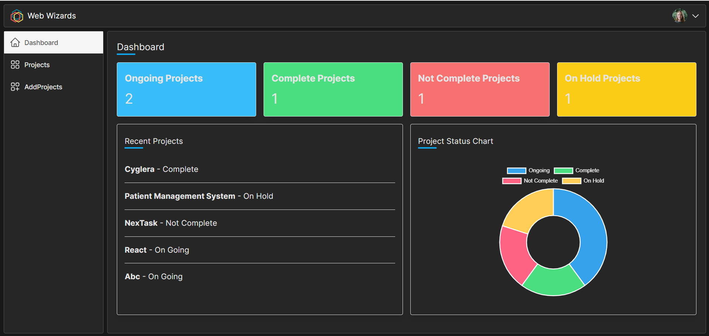

This is a [Next.js](https://nextjs.org/) project bootstrapped with [`create-next-app`](https://github.com/vercel/next.js/tree/canary/packages/create-next-app).

## Getting Started

First, run the development server:

```bash
npm run dev
# or
yarn dev
# or
pnpm dev
# or
bun dev
```

Open [http://localhost:3000](http://localhost:3000) with your browser to see the result.

You can start editing the page by modifying `app/page.tsx`. The page auto-updates as you edit the file.

This project uses [`next/font`](https://nextjs.org/docs/basic-features/font-optimization) to automatically optimize and load Inter, a custom Google Font.

Our project is Project Management System. The main users are - Mentors/Managers and Employees

Author: Tirth Shah
User Authentication: Manager and Employees can register with role as "manager" and "employee" inorder to provide role based access for different pages. Like in our project the manager can create, view and delete his/her project whereas the employee can only view the project assigned to him/her.

Registration: 


Login:


Author: Harman Sikand
Dashboard: Get the project using the status so the counts of projects by status and its chart representation using Chart.js library.


Author: Jay Shah
Add Project page: Using form to submit the project details in order to add it to database


Projects page: List all the user's projects thorugh cards with all the project details


Filter by status feature: Porject can be filtered by status: On going, On hold, Complete, Incomplete

Author: Monica Mehta
Project Detail page:
This page shows the project detailed page with a table that displays the task of employees.


Task form: User can fill out the form to add task in the project. The user can also edit and update the same task.
The employee to whom this task is assigned can it when they log in to their account.


